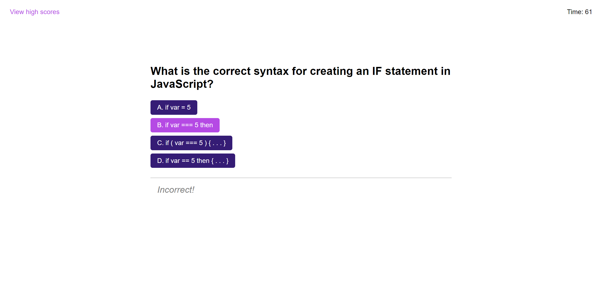

# code-quiz

A study in creating a timed quiz with JavaScript

## Contents

- [Introduction](#introduction)
- [Problem](#problem)
- [Solution](#solution)
- [Deployment](#deployment)
- [Collaborators](#collaborators)
- [Resources](#resources)
- [License](#License)

## Introduction

For this project, I set out to create a timed multiple-choice quiz to test a user's knowledge of JavaScript fundamentals. The quiz involves answering a set of ten questions, randomly selected each time from a set of fifteen possible questions. The user will have time deducted from the clock for any wrong answers, and their final time at the end of the quiz can be saved along with their initials to a leaderboard that persists by utilizing localStorage.

## Problem

No starter code was provided for this project. The client desired the following features for this project:

- GIVEN I am taking a code quiz
  - WHEN I click the start button
  - THEN a timer starts and I am presented with a question
- WHEN I answer a question
  - THEN I am presented with another question
- WHEN I answer a question incorrectly
  - THEN time is subtracted from the clock
- WHEN all questions are answered or the timer reaches 0
  - THEN the game is over
- WHEN the game is over
  - THEN I can save my initials and score

## Solution

I addressed the above requirements in the following way:

- Built custom HTML & CSS to match the client's mockup.
- Developed JS functionality for the timer, DOM manipulation, and handling the user's final score.
- Developed JS functionality for saving the user's initials and score to localStorage, and updating the persistent leaderboard.

See below for a screenshot of the project.

## Deployment

[Link to the GitHub repo for this project](https://github.com/Aoliva96/code-quiz)

[Link to the deployed project on GitPages](https://aoliva96.github.io/code-quiz)

## Collaborators

While I did not collaborate with anyone else on this project, I did utilize the EdX Xpert Learning Assistant and GitHub Copilot tools for debugging, JS structuring and illustrating code concepts.

## Resources

See the links below to see some of the resources I used for this project:

[MDN | JavaScript SetTimeout()](https://developer.mozilla.org/en-US/docs/Web/API/setTimeout)

[MDN | JavaScript SetInterval()](https://developer.mozilla.org/en-US/docs/Web/API/setInterval)

[MDN | JavaScript Element.classList](https://developer.mozilla.org/en-US/docs/Web/API/Element/classList)

I also referenced the week four class activities for handling JavaScript timers and DOM manipulation.

## License

This project utilizes the standard MIT License.
